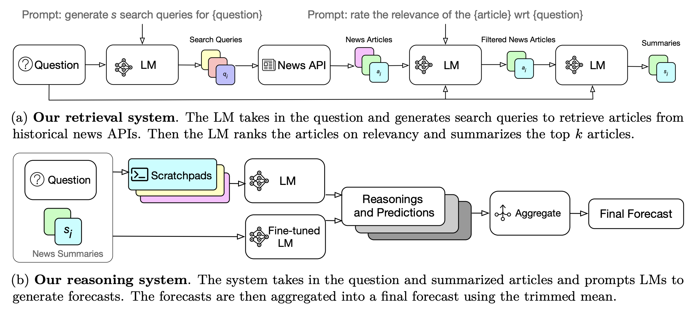

# LLM Forecasting

This repository hosts the code for the paper: [Approaching Human-Level Forecasting with Language Models](https://arxiv.org/abs/2402.18563).

Our system is designed to make automated, _simulated_ forecasts by following these steps:
1. **Search Query Generation**: A language model (LM) is prompted to create search queries to retrieve articles published before a certain date from a news API.
2. **Assess Article Relevancy**: A LM rates the relevancy of the retrieved articles and filters out non-relevant ones.
3. **Summarize Articles**: A LM is prompted to retain the salient information relevant to the question from the filtered articles.
4. **Reason and Predict**: A LM (base or fine-tuned) is prompted multiple times to produce reasoning and predictions based on the article summaries.
5. **Forecast Aggregation**: An aggregation method is applied to all the predictions to obtain a final forecast.

<p align="center">
  
</p>

We've designed our system to be easily scalable to other news APIs and language models.

## Development Guide
This guide will help you set up your development environment for the project. Make sure you follow these steps under the root directory of the project (where **pyproject.toml** is located).

### Prerequisites
**Miniconda or Anaconda**:
Ensure you have Miniconda or Anaconda installed as they include the Conda package manager.

### Setting Up Your Environment
1. **Create and Activate a Conda Environment** <br>
Start by creating a Conda environment specifically for this project.
```
conda create -n myenv python=3.11
conda activate myenv
```
Replace **myenv** with your preferred environment name and adjust **python=3.11** if needed.


2. **Install Setuptools and Upgrade Build** <br>
Within your Conda environment:
```
conda install setuptools
pip install --upgrade build
```

3. **Install Package in Editable Mode** <br>
Install the package in editable mode to allow changes in your code to be immediately reflected in the installed package. This also installs all dependencies listed in `project.toml`.
```
pip install --editable .
```

### Usage
Once the setup is complete, you can start using the package. For example, you can import modules from the forecasting subdirectory as follows:
```
import information_retrieval
import utils
from prompts.prompts import prompt_dict
```

### Deactivating Your Environment
When you're finished working, you can deactivate the Conda environment:
```
conda deactivate
```

## Demo
See the [system_demo](https://github.com/dannyallover/llm_forecasting/blob/main/notebooks/demo/system_demo.ipynb) for an example on how to run our system.

## Dataset
The cleaned and formatted dataset can be found on [huggingface](https://huggingface.co/datasets/YuehHanChen/forecasting), as well as the [raw dataset](https://huggingface.co/datasets/YuehHanChen/forecasting_raw).

## Contributing
We welcome contributions to this repository. If you'd like to contribute, please follow these steps:

1. Fork the repository.
2. Create a new branch for your feature or bug fix: `git checkout -b my-new-feature`
3. Make your changes and commit them: `git commit -am 'Add some feature'`
4. Push your changes to your forked repository: `git push origin my-new-feature`
5. Open a pull request against the main repository.

Please ensure that your code adheres to the project's coding conventions and that you include tests for any new functionality or bug fixes.

## Citation
If our codebase, dataset, or paper proves fruitful for your work, please consider citing us.
```
@misc{halawi2024approaching,
      title={Approaching Human-Level Forecasting with Language Models}, 
      author={Danny Halawi and Fred Zhang and Chen Yueh-Han and Jacob Steinhardt},
      year={2024},
      eprint={2402.18563},
      archivePrefix={arXiv},
      primaryClass={cs.LG}
}
```
